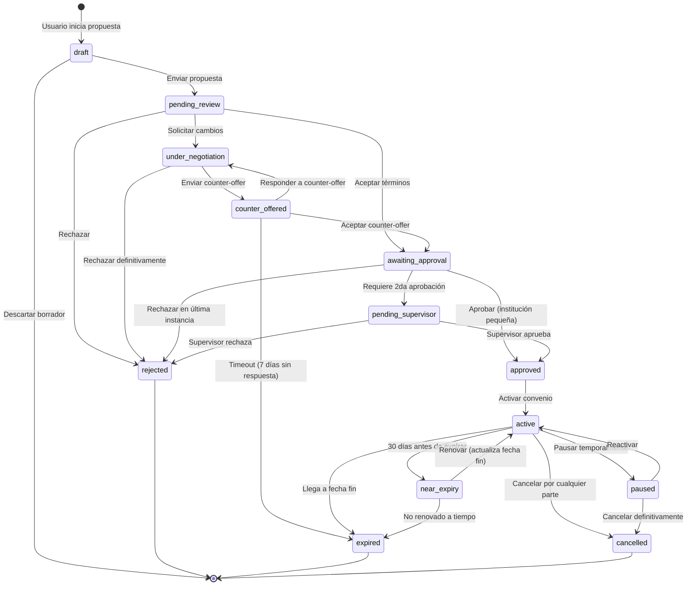

# Análisis y Recomendaciones: Sistema de Convenios Bidireccionales para Programas de Fidelización

**Fecha de análisis:** Octubre 2025
**Proyecto:** WP Cupon WhatsApp - Sistema de Beneficios Institucionales
**Enfoque:** Análisis de mejores prácticas y recomendaciones implementables

---

## Índice

1. [Resumen Ejecutivo](#resumen-ejecutivo)
2. [Análisis del Sistema Actual](#análisis-del-sistema-actual)
3. [Benchmarking de la Industria](#benchmarking-de-la-industria)
4. [Flujo Bidireccional Recomendado](#flujo-bidireccional-recomendado)
5. [Diagrama de Estados del Convenio](#diagrama-de-estados-del-convenio)
6. [Campos y Metadatos Necesarios](#campos-y-metadatos-necesarios)
7. [Estadísticas e Indicadores Clave (KPIs)](#estadísticas-e-indicadores-clave-kpis)
8. [Mejoras de Experiencia de Usuario (UX)](#mejoras-de-experiencia-de-usuario-ux)
9. [Plan de Implementación](#plan-de-implementación)
10. [Referencias de la Industria](#referencias-de-la-industria)

---

## 1. Resumen Ejecutivo

### Estado Actual
El sistema actual implementa un flujo **unidireccional** donde:
- Los COMERCIOS proponen convenios a INSTITUCIONES
- Las INSTITUCIONES aprueban/rechazan vía email con token seguro
- Estados básicos: `pending`, `active`, `rejected`, `expired`
- Sin capacidad de negociación o contra-propuestas

### Hallazgos Clave de la Investigación

#### Mejores Prácticas de Marketplaces B2B (2025)
- **80% de interacciones B2B** ocurren en canales digitales (Gartner, 2025)
- Plataformas como **Pluxee** (antes Sodexo) invierten 10% de ingresos en tecnología
- Marketplaces bidireccionales generan **$350B+ en ventas** (2024)
- Liquidez del marketplace es **el KPI más crítico** (transacciones completadas)

#### Características Esenciales de Sistemas Exitosos
1. **Propuestas bidireccionales** (ambas partes pueden iniciar)
2. **Negociación estructurada** con counter-offers
3. **Aprobaciones multi-nivel** para instituciones grandes
4. **Automatización de workflows** para reducir fricción
5. **Métricas en tiempo real** para ambas partes

---

## 2. Análisis del Sistema Actual

### 2.1 Arquitectura de Datos Existente

```
Custom Post Types:
├── wpcw_institution (Instituciones)
├── wpcw_business (Comercios)
├── wpcw_convenio (Convenios)
└── shop_coupon (Cupones de WooCommerce)

Tabla Custom:
└── wp_wpcw_canjes (Registro de canjes)

Relaciones:
- Convenio → 1 Proveedor (Comercio)
- Convenio → 1 Receptor (Institución)
- Cupón → 1 Convenio (_wpcw_associated_convenio_id)
- Canje → 1 Convenio + 1 Cupón + 1 Usuario + 1 Comercio
```

### 2.2 Metadatos del Convenio Actual

| Campo | Uso Actual | Necesidad |
|-------|-----------|-----------|
| `_convenio_provider_id` | ID del comercio proveedor | **Esencial** |
| `_convenio_recipient_id` | ID de la institución receptora | **Esencial** |
| `_convenio_status` | Estado: pending/active/rejected/expired | **Expandir** |
| `_convenio_terms` | Términos en texto libre | **Mantener** |
| `_convenio_discount_percentage` | Porcentaje de descuento | Opcional |
| `_convenio_max_uses_per_beneficiary` | Límite por beneficiario | Opcional |
| `_convenio_start_date` | Fecha de inicio | Opcional |
| `_convenio_end_date` | Fecha de fin | Opcional |
| `_convenio_originator_id` | Usuario que propuso | **Esencial** |
| `_convenio_response_token` | Token de seguridad para respuesta | **Mantener** |
| `_convenio_approved_by` | Usuario que aprobó | **Esencial** |
| `_convenio_approved_at` | Timestamp de aprobación | **Esencial** |

### 2.3 Flujo Actual Identificado

```
1. COMERCIO crea propuesta
   └─> convenio (status: pending, post_status: pending)

2. Email enviado a INSTITUCIÓN con link tokenizado
   └─> /responder-convenio/?convenio_id=X&token=Y

3. INSTITUCIÓN revisa en página pública
   └─> Opciones: Aceptar | Rechazar

4. Al aceptar:
   ├─> convenio_status: 'active'
   ├─> post_status: 'publish'
   ├─> Token invalidado
   └─> Comercio puede crear cupones

5. Al rechazar:
   ├─> convenio_status: 'rejected'
   ├─> post_status: 'trash'
   └─> Proceso terminado
```

### 2.4 Limitaciones Identificadas

| Limitación | Impacto | Prioridad de Solución |
|------------|---------|----------------------|
| **No hay propuestas desde Instituciones** | Instituciones pasivas, menos compromiso | 🔴 ALTA |
| **Sin capacidad de contra-oferta** | Todo-o-nada, menor flexibilidad | 🔴 ALTA |
| **Aprobación de un solo paso** | No funciona para instituciones grandes | 🟡 MEDIA |
| **Sin historial de negociación** | Difícil auditar o aprender | 🟡 MEDIA |
| **No hay métricas de desempeño** | Imposible optimizar | 🔴 ALTA |
| **Sin borradores compartidos** | No hay colaboración pre-aprobación | 🟢 BAJA |
| **Fechas opcionales** | Convenios sin vigencia clara | 🟡 MEDIA |

---

## 3. Benchmarking de la Industria

### 3.1 Pluxee (Sodexo Benefits) - Líder Global

**Modelo de Negocio:**
- Marketplace de beneficios corporativos
- 250+ productos en 31 países
- Plataforma móvil-first con cashback instantáneo

**Características Relevantes:**
- **Admin-light experience:** Mínima fricción administrativa para HR
- **Real-time reporting:** Dashboards con datos en vivo
- **Aprobación centralizada:** Un dashboard para todos los beneficios
- **Integración con nómina:** Automatización de asignación de beneficios

**Aplicable a nuestro proyecto:**
- Simplificar el proceso de aprobación institucional
- Dashboard único con visibilidad completa
- Reportes automáticos de uso

### 3.2 Marketplaces B2B de Dos Lados

**KPIs Críticos Identificados:**

1. **Liquidity (Liquidez)**
   - Porcentaje de propuestas que resultan en convenios activos
   - Tiempo promedio desde propuesta hasta activación
   - Ratio de comercios activos vs registrados

2. **Take Rate**
   - No aplicable directamente (no cobramos comisión)
   - Equivalente: % de convenios que generan canjes reales

3. **LTV/CAC Ratio**
   - Lifetime Value del convenio vs costo de adquisición
   - Meta: >3X en valor de canjes vs esfuerzo de onboarding

4. **Churn Rate**
   - % de convenios que expiran sin renovación
   - % de instituciones/comercios que se desactivan

5. **Match Rate**
   - Éxito en conectar instituciones con comercios relevantes
   - Velocidad de match: tiempo hasta primera propuesta

### 3.3 Contract Negotiation Lifecycle (Harvard PON)

**Fases de Negociación Documentadas:**

1. **Opening Phase (Apertura)**
   - Una parte presenta demanda/oferta inicial
   - Usualmente rechazada para abrir negociación

2. **Testing Phase (Prueba)**
   - Ambas partes justifican posiciones
   - Probing para encontrar puntos de acuerdo

3. **Agreeing Phase (Acuerdo)**
   - Términos finales acordados
   - Cierre formal

**Best Practices de Counter-Offers:**
- Skilled negotiators EVITAN contra-propuestas tempranas
- Counter-offers efectivos al FINAL del proceso
- Dos tipos de rationale: constraint (limitaciones) y disparagement (críticas)

**Aplicable a nuestro proyecto:**
- Permitir 1-2 rondas de counter-offer como máximo
- Counter-offer debe incluir justificación obligatoria
- Timeout en negociaciones (ej: 7 días sin respuesta = expirada)

---

## 4. Flujo Bidireccional Recomendado

### 4.1 Iniciadores de Propuesta

| Iniciador | Escenario | Flujo |
|-----------|-----------|-------|
| **Comercio** | Quiere acceder a miembros de institución específica | Propuesta directa con términos |
| **Institución** | Busca beneficios para sus miembros en categoría | Solicitud abierta o propuesta dirigida |
| **Administrador** | Match manual entre comercio e institución | Convenio pre-aprobado bilateral |

### 4.2 Información Intercambiada en la Negociación

#### Propuesta Inicial (Cualquier Parte)
```yaml
Datos Obligatorios:
  - Proveedor (Comercio ID)
  - Receptor (Institución ID)
  - Términos del beneficio (texto)
  - Tipo de descuento (porcentaje/fijo/otro)
  - Valor del descuento
  - Vigencia (fecha inicio/fin)

Datos Opcionales:
  - Usos máximos por beneficiario
  - Categorías de producto aplicables
  - Restricciones geográficas
  - Horarios válidos
  - Condiciones especiales
```

#### Counter-Offer
```yaml
Datos Modificables:
  - Valor del descuento (puede negociarse)
  - Vigencia (fechas)
  - Usos máximos
  - Términos adicionales

Datos Obligatorios:
  - Justificación del cambio (textarea)
  - Cambios propuestos (diff automático)

Datos No Modificables:
  - Proveedor
  - Receptor
  - Tipo de beneficio base
```

### 4.3 Roles Involucrados y Permisos

| Rol | Capacidad | Acciones Permitidas |
|-----|-----------|---------------------|
| **Business Owner** | `manage_business_profile` | Proponer convenio, aceptar/rechazar propuestas recibidas, hacer counter-offer |
| **Institution Manager** | `manage_institution` | Proponer convenio, aceptar/rechazar propuestas recibidas, hacer counter-offer |
| **Benefits Supervisor** | `approve_institution_benefits` | Solo aprobar propuestas ya negociadas (segundo nivel) |
| **Administrator** | `manage_woocommerce` | Crear convenios pre-aprobados, forzar estados, auditoría |

---

## 5. Diagrama de Estados del Convenio

### 5.1 Estados Expandidos Recomendados

```
Estados Propuestos (12 estados):

FASE 1: NEGOCIACIÓN
├─ draft              (Borrador en creación)
├─ pending_review     (Enviado, esperando primera revisión)
├─ under_negotiation  (En negociación activa)
├─ counter_offered    (Contra-propuesta enviada)
└─ awaiting_approval  (Negociación cerrada, esperando aprobación final)

FASE 2: APROBACIÓN
├─ pending_supervisor (Esperando aprobación de supervisor institucional)
└─ approved           (Aprobado, pendiente de activación)

FASE 3: ACTIVO
├─ active             (Convenio activo y operativo)
├─ paused             (Pausado temporalmente)
└─ near_expiry        (Próximo a vencer, requiere renovación)

FASE 4: TERMINAL
├─ rejected           (Rechazado definitivamente)
├─ expired            (Expiró por fecha o inactividad)
└─ cancelled          (Cancelado por alguna de las partes)
```

### 5.2 Diagrama de Transiciones



### 5.3 Tabla de Transiciones Válidas

| Estado Actual | Estados Siguientes Válidos | Quién Puede Transicionar |
|---------------|---------------------------|--------------------------|
| `draft` | `pending_review`, descarte | Originator |
| `pending_review` | `under_negotiation`, `awaiting_approval`, `rejected` | Receptor |
| `under_negotiation` | `counter_offered`, `rejected` | Cualquiera de las partes |
| `counter_offered` | `under_negotiation`, `awaiting_approval`, `expired` | Receptor del counter-offer |
| `awaiting_approval` | `pending_supervisor`, `approved`, `rejected` | Institution Manager |
| `pending_supervisor` | `approved`, `rejected` | Benefits Supervisor |
| `approved` | `active` | Sistema automático o Admin |
| `active` | `paused`, `near_expiry`, `cancelled`, `expired` | Business/Institution, Sistema |
| `paused` | `active`, `cancelled` | Quien pausó |
| `near_expiry` | `active` (renovar), `expired` | Business/Institution, Sistema |
| Terminal: `rejected`, `expired`, `cancelled` | Sin transiciones | N/A |

---

## 6. Campos y Metadatos Necesarios

### 6.1 Nuevos Metadatos a Agregar

#### Negociación y Versionado
```php
// Historial de negociación
_convenio_negotiation_history: array serializado
  [
    {
      'version': 1,
      'user_id': 123,
      'user_role': 'business_owner',
      'action': 'proposed',
      'timestamp': '2025-10-13 10:30:00',
      'changes': [],
      'comment': 'Propuesta inicial'
    },
    {
      'version': 2,
      'user_id': 456,
      'user_role': 'institution_manager',
      'action': 'counter_offered',
      'timestamp': '2025-10-14 15:20:00',
      'changes': [
        'discount_percentage' => ['old' => 15, 'new' => 20],
        'max_uses_per_beneficiary' => ['old' => 0, 'new' => 3]
      ],
      'comment': 'Solicitamos incrementar descuento'
    }
  ]

// Versión actual de términos
_convenio_version_current: int (1, 2, 3...)

// Justificación del último cambio
_convenio_last_change_reason: string

// Estado de aprobación multi-nivel
_convenio_approval_level: int (1 o 2)
_convenio_requires_supervisor: bool (true/false)
_convenio_supervisor_id: int (user_id del Benefits Supervisor)
_convenio_supervisor_approved_at: datetime
```

#### Métricas y Tracking
```php
// Rendimiento del convenio
_convenio_total_coupons_created: int
_convenio_total_redemptions: int
_convenio_total_beneficiaries_unique: int
_convenio_last_redemption_date: date

// Alertas
_convenio_days_until_expiry: int (calculado)
_convenio_renewal_reminder_sent: bool
_convenio_last_activity_date: date

// Participación
_convenio_initiator_type: string ('business' | 'institution' | 'admin')
_convenio_negotiation_rounds: int (contador de contra-ofertas)
```

#### Configuración Avanzada
```php
// Restricciones geográficas
_convenio_valid_locations: array (IDs de sucursales o ciudades)

// Restricciones temporales
_convenio_valid_days_of_week: array (['monday', 'tuesday'...])
_convenio_valid_hours: string ('09:00-18:00')

// Categorías de producto (si usa WooCommerce)
_convenio_valid_product_categories: array (term_ids)
_convenio_excluded_products: array (product_ids)

// Comunicación
_convenio_primary_contact_business: string (email)
_convenio_primary_contact_institution: string (email)
_convenio_notification_preferences: array
```

### 6.2 Cambios en Post Meta Existentes

| Meta Key Actual | Acción | Nuevo Comportamiento |
|-----------------|--------|---------------------|
| `_convenio_status` | **EXPANDIR** | Incluir 12 nuevos estados |
| `_convenio_terms` | **MANTENER + VERSIONAR** | Guardar histórico de cambios |
| `_convenio_start_date` | **HACER OBLIGATORIO** | Validación al aprobar |
| `_convenio_end_date` | **HACER OBLIGATORIO** | Cálculo automático de `near_expiry` |
| `_convenio_response_token` | **EXPANDIR** | Tokens por versión de negociación |

### 6.3 Taxonomías Recomendadas

```php
// Nueva taxonomía para categorizar convenios
register_taxonomy('wpcw_convenio_type', 'wpcw_convenio', [
    'hierarchical' => true,
    'labels' => [
        'name' => 'Tipos de Convenio',
        'singular_name' => 'Tipo de Convenio'
    ],
    'show_in_rest' => true,
    'terms' => [
        'Descuento Porcentual',
        'Descuento Fijo',
        '2x1 o Promociones',
        'Beneficio Exclusivo',
        'Cashback',
        'Puntos'
    ]
]);

// Categorías de comercio para matching
register_taxonomy('wpcw_business_category', 'wpcw_business', [
    'hierarchical' => true,
    'terms' => [
        'Gastronomía',
        'Salud y Bienestar',
        'Educación',
        'Entretenimiento',
        'Retail',
        'Servicios Profesionales',
        'Tecnología',
        'Viajes y Turismo'
    ]
]);
```

---

## 7. Estadísticas e Indicadores Clave (KPIs)

### 7.1 Dashboard para INSTITUCIONES

#### Métricas Principales (Hero Numbers)
```
┌─────────────────────────────────────────────────────┐
│  CONVENIOS ACTIVOS          BENEFICIARIOS ACTIVOS   │
│       12                           850              │
│  ↑ 2 este mes                  ↑ 15% vs mes pasado │
├─────────────────────────────────────────────────────┤
│  CANJES ESTE MES            AHORRO GENERADO         │
│       347                      $45,230 MXN          │
│  ↑ 23% vs mes pasado          ↑ 18% vs mes pasado  │
└─────────────────────────────────────────────────────┘
```

#### Tabla de Convenios
```
| Comercio | Categoría | Descuento | Canjes/Mes | Beneficiarios Únicos | Estado | Vence en |
|----------|-----------|-----------|------------|---------------------|--------|----------|
| Pizza Hut | Gastronomía | 15% | 89 | 67 | 🟢 Activo | 45 días |
| Cinépolis | Entretenimiento | 2x1 | 124 | 98 | 🟠 Por vencer | 12 días |
```

#### Gráficas Esenciales
1. **Canjes por Mes** (Línea de tiempo)
2. **Top 10 Comercios por Uso** (Barras horizontales)
3. **Distribución por Categoría** (Pie chart)
4. **Tasa de Adopción** (% de beneficiarios que usaron al menos 1 cupón)

#### KPIs Institucionales Específicos

| Métrica | Descripción | Fórmula | Meta Benchmark |
|---------|-------------|---------|----------------|
| **Engagement Rate** | % de miembros activos | (Beneficiarios con ≥1 canje / Total miembros) × 100 | >40% |
| **Convenience Value** | Ahorro promedio por miembro | Total ahorro / Total miembros | >$500 MXN/año |
| **Portfolio Diversity** | Variedad de categorías usadas | # categorías con canjes / # categorías disponibles | >60% |
| **Member Satisfaction** | NPS de beneficiarios | Encuesta post-canje | >50 |
| **Proposal Success Rate** | % de propuestas enviadas que se activan | Convenios activos / Propuestas enviadas | >70% |

### 7.2 Dashboard para COMERCIOS

#### Métricas Principales
```
┌─────────────────────────────────────────────────────┐
│  CONVENIOS ACTIVOS          CANJES ESTE MES         │
│        3                          156               │
│  →                            ↑ 34% vs mes pasado   │
├─────────────────────────────────────────────────────┤
│  CLIENTES ÚNICOS            VENTAS ATRIBUIBLES      │
│       89                       $12,450 MXN          │
│  ↑ 12 nuevos este mes         ↑ 28% vs mes pasado  │
└─────────────────────────────────────────────────────┘
```

#### Tabla de Convenios del Comercio
```
| Institución | Miembros Potenciales | Canjes/Mes | Ticket Promedio | ROI Estimado | Estado |
|-------------|---------------------|------------|-----------------|-------------|--------|
| Sindicato Educadores | 850 | 89 | $140 | 4.2x | 🟢 Activo |
| Club Deportivo | 320 | 45 | $95 | 2.8x | 🟢 Activo |
| Asociación Médicos | 450 | 22 | $210 | 5.1x | 🟠 Bajo uso |
```

#### KPIs para Comercios

| Métrica | Descripción | Fórmula | Meta Benchmark |
|---------|-------------|---------|----------------|
| **Redemption Rate** | % de cupones canjeados | (Cupones canjeados / Cupones emitidos) × 100 | >30% |
| **Customer Acquisition Cost (CAC)** | Costo por nuevo cliente | Descuento total / Clientes únicos nuevos | <$50 MXN |
| **Repeat Customer Rate** | % de clientes que regresan | (Clientes con ≥2 canjes / Total clientes) × 100 | >45% |
| **Average Ticket Lift** | Incremento en ticket vs clientes regulares | (Ticket con cupón - Ticket sin cupón) / Ticket sin cupón | >15% |
| **Agreement Reach** | Cobertura de mercado | Miembros totales de instituciones activas | Variable |

### 7.3 Dashboard para ADMINISTRADORES

#### Visión General de la Plataforma
```
┌──────────────────────────────────────────────────────────────────┐
│  MARKETPLACE HEALTH                                              │
├──────────────────────────────────────────────────────────────────┤
│  Instituciones Activas: 24         Comercios Activos: 156       │
│  Convenios Activos: 342            Canjes Este Mes: 12,450      │
│  Liquidity Rate: 78%               Match Success: 82%            │
└──────────────────────────────────────────────────────────────────┘
```

#### KPIs de Marketplace Bidireccional

| Métrica | Descripción | Fórmula | Meta Benchmark |
|---------|-------------|---------|----------------|
| **Marketplace Liquidity** | % de propuestas que se activan | (Convenios activos / Total propuestas) × 100 | >75% |
| **Time to Activation** | Días promedio desde propuesta hasta activo | AVG(fecha_active - fecha_proposed) | <7 días |
| **Counter-Offer Rate** | % de negociaciones con contra-oferta | (Convenios con ≥1 counter-offer / Total propuestas) × 100 | 15-25% (ideal) |
| **Supervisor Rejection Rate** | % rechazado en 2da aprobación | (Rechazos supervisor / Total a supervisor) × 100 | <10% |
| **Platform Churn (Instituciones)** | % de instituciones que se vuelven inactivas | (Instituciones sin convenio activo 90d / Total) × 100 | <15% |
| **Platform Churn (Comercios)** | % de comercios que se vuelven inactivos | (Comercios sin convenio activo 90d / Total) × 100 | <20% |
| **Network Density** | Conexiones promedio por nodo | (Total convenios × 2) / (Instituciones + Comercios) | >2.5 |

#### Tabla de Convenios Globales con Filtros Avanzados
```
Filtros disponibles:
- Estado (todos los 12 estados)
- Fase (Negociación / Aprobación / Activo / Terminal)
- Categoría de comercio
- Tamaño de institución
- Rendimiento (alto/medio/bajo uso)
- Próximos a vencer (30/15/7 días)
```

### 7.4 Reportes Automatizados Recomendados

#### Frecuencia Semanal
- **Instituciones:** Top 5 convenios más usados, nuevos comercios disponibles
- **Comercios:** Resumen de canjes, clientes nuevos, comparativa vs semana anterior

#### Frecuencia Mensual
- **Instituciones:** Reporte ejecutivo con ahorro total, engagement, recomendaciones
- **Comercios:** Análisis de ROI, sugerencias de optimización
- **Administradores:** Dashboard ejecutivo con KPIs de marketplace

#### Alertas en Tiempo Real
- Convenio próximo a vencer (30, 15, 7 días antes)
- Convenio con bajo uso (< 5 canjes en 30 días)
- Propuesta sin respuesta (3, 5, 7 días)
- Comercio/Institución inactivo (60 días sin actividad)

---

## 8. Mejoras de Experiencia de Usuario (UX)

### 8.1 Simplificación del Proceso

#### Problema Actual
- Comercios deben salir de WordPress para revisar propuestas (email + link público)
- Instituciones no tienen visibilidad de convenios activos en su dashboard
- Sin indicadores visuales de estado o progreso

#### Solución: Dashboard Unificado con Estados Visuales

```
┌─────────────────────────────────────────────────────────────┐
│  MIS CONVENIOS                                    [+ Nuevo] │
├─────────────────────────────────────────────────────────────┤
│  Tabs:  [ Activos (12) ]  [ Pendientes (3) ]  [ Todos ]   │
├─────────────────────────────────────────────────────────────┤
│                                                              │
│  🟡 ESPERANDO TU RESPUESTA                                  │
│  ┌────────────────────────────────────────────────────────┐ │
│  │ Pizzería Don Antonio → Tu Institución                 │ │
│  │ Propuesta: 15% descuento en consumo                   │ │
│  │ Enviado: hace 2 días                                   │ │
│  │ [Ver Detalles] [Aceptar] [Hacer Counter-Offer] [X]   │ │
│  └────────────────────────────────────────────────────────┘ │
│                                                              │
│  🟢 ACTIVO                                                   │
│  ┌────────────────────────────────────────────────────────┐ │
│  │ Cinépolis                                    89 canjes │ │
│  │ 2x1 en entradas                        Vence: 45 días │ │
│  │ [Ver Stats] [Pausar] [Renovar]                        │ │
│  └────────────────────────────────────────────────────────┘ │
│                                                              │
└─────────────────────────────────────────────────────────────┘
```

### 8.2 Wizard de Propuesta Paso a Paso

En lugar de un formulario largo, usar wizard multi-paso:

```
Paso 1: ¿A quién quieres proponer?
  [ ] Seleccionar institución existente
  [ ] Invitar nueva institución (email)

Paso 2: Define tu beneficio
  Tipo: (●) Descuento porcentual  ( ) Descuento fijo  ( ) Promoción 2x1
  Valor: [___15___] %
  Términos: [Aplicable a todo el menú, excepto bebidas alcohólicas]

Paso 3: Restricciones (opcional)
  [ ] Limitar usos por persona: [_3_]
  [ ] Válido solo ciertos días: [✓] Lun-Vie
  [ ] Horarios específicos: 09:00 - 18:00

Paso 4: Vigencia
  Desde: [01/11/2025]  Hasta: [31/12/2025]  (60 días)

[← Atrás]  [Enviar Propuesta →]
```

### 8.3 Notificaciones: Cuándo y Cómo

#### Canal de Notificación por Evento

| Evento | Email | In-App | WhatsApp* | SMS* |
|--------|-------|--------|-----------|------|
| **Nueva propuesta recibida** | ✅ Inmediato | ✅ Badge | ⚪ Opcional | ❌ No |
| **Counter-offer recibida** | ✅ Inmediato | ✅ Badge | ⚪ Opcional | ❌ No |
| **Propuesta aceptada** | ✅ Inmediato | ✅ Notificación | ⚪ Opcional | ❌ No |
| **Convenio activado** | ✅ Inmediato | ✅ Notificación | ✅ Sí | ❌ No |
| **Convenio próximo a vencer (30d)** | ✅ Weekly digest | ✅ Badge | ❌ No | ❌ No |
| **Convenio próximo a vencer (7d)** | ✅ Inmediato | ✅ Notificación | ⚪ Opcional | ⚪ Opcional |
| **Propuesta sin respuesta (5d)** | ✅ Reminder | ✅ Badge | ❌ No | ❌ No |
| **Convenio con bajo uso** | ✅ Monthly digest | ⚪ Opcional | ❌ No | ❌ No |

*WhatsApp y SMS: Requieren consentimiento explícito y configuración adicional

#### Preferencias de Notificación por Rol

```php
// Meta del usuario para preferencias
_wpcw_notification_preferences: [
    'email' => [
        'new_proposal' => true,
        'counter_offer' => true,
        'approval' => true,
        'expiry_warning' => true,
        'weekly_digest' => false
    ],
    'in_app' => [
        'all' => true
    ],
    'whatsapp' => [
        'high_priority_only' => true,
        'phone_number' => '+521234567890'
    ]
]
```

### 8.4 Dashboards Separados vs Unificado

**Recomendación: UNIFICADO con vistas específicas por rol**

#### Justificación
- Pluxee y otros líderes usan dashboard unificado
- Reduce curva de aprendizaje
- Consistencia en UX
- Más fácil de mantener

#### Implementación
```
Panel Principal de Convenios
├─ Vista: Business Owner
│  ├─ Mis Propuestas Enviadas
│  ├─ Propuestas Recibidas (de instituciones que me buscan)
│  ├─ Convenios Activos (con stats de canjes)
│  └─ Acciones: [Proponer Nuevo Convenio]
│
├─ Vista: Institution Manager
│  ├─ Propuestas Recibidas (de comercios)
│  ├─ Mis Solicitudes Enviadas (a comercios)
│  ├─ Convenios Activos (con stats de uso por miembros)
│  └─ Acciones: [Buscar Comercios] [Solicitar Convenio]
│
├─ Vista: Benefits Supervisor
│  ├─ Convenios Pendientes de Mi Aprobación
│  ├─ Histórico de Aprobaciones
│  └─ Sin opción de crear nuevos (solo aprobar)
│
└─ Vista: Administrator
   ├─ TODOS los convenios (tabla completa)
   ├─ Filtros avanzados
   ├─ Auditoría completa
   └─ Acciones: [Crear Pre-Aprobado] [Forzar Estado]
```

### 8.5 Onboarding para Usuarios No Técnicos

#### Primera Vez: Business Owner
```
1. Bienvenida con video corto (30 seg)
   "Cómo funcionan los convenios"

2. Tour guiado interactivo (4 pasos)
   → "Aquí verás propuestas recibidas"
   → "Aquí puedes crear una propuesta"
   → "Aquí están tus convenios activos"
   → "Aquí ves estadísticas de canjes"

3. Sugerencia de primera acción
   "¿Quieres proponer un convenio a una institución?"
   [Sí, empecemos] [Más tarde]

4. Templates pre-definidos
   "Usa una plantilla para acelerar:"
   - 15% descuento general
   - 2x1 en producto específico
   - Descuento escalonado por volumen
```

#### Ayuda Contextual
- Tooltips en cada campo
- Link "¿Cómo funciona esto?" en cada sección
- Chat de soporte (si disponible) o email directo

### 8.6 Mejoras Visuales Recomendadas

#### Estados con Colores y Iconos Consistentes
```
🟡 Amarillo: Requiere acción (pending_review, counter_offered)
🔵 Azul: En proceso (under_negotiation, awaiting_approval)
🟢 Verde: Activo y saludable (active)
🟠 Naranja: Requiere atención (paused, near_expiry)
🔴 Rojo: Terminal negativo (rejected, expired, cancelled)
⚪ Gris: Borrador o inactivo (draft)
```

#### Progress Bar para Negociación
```
Propuesta → Revisión → Negociación → Aprobación → Activo
    ●──────────●──────────●──────────○──────────○
```

#### Badges Informativos
```
🆕 Nuevo (< 24h)
🔥 Popular (alto uso)
⏰ Vence pronto (< 30 días)
⚠️ Bajo uso (< 10% de miembros)
✨ Recomendado
```

---

## 9. Plan de Implementación

### 9.1 Enfoque de Implementación: Iterativo e Incremental

**Filosofía:** No romper el sistema actual, agregar capacidades gradualmente

### 9.2 Fase 1: Fundamentos (Sprint 1-2, 2 semanas)

#### Objetivos
- Expandir estados del convenio
- Implementar historial de negociación
- Agregar metadatos básicos

#### Tareas Técnicas
```
✓ Actualizar enums de estado en convenio-meta-boxes.php
✓ Crear función helper para transiciones válidas
✓ Agregar campos meta para versionado
✓ Migración de datos: convenios existentes a nuevo formato
✓ Testing de retrocompatibilidad
```

#### Entregables
- Estados expandidos funcionando
- Dashboard de administrador muestra nuevos estados
- Sin afectar convenios existentes

#### Riesgos
- **Bajo:** Solo afecta backend, sin cambios en flujo de usuario aún

### 9.3 Fase 2: Propuestas Bidireccionales (Sprint 3-4, 2 semanas)

#### Objetivos
- Instituciones pueden proponer convenios
- Formulario unificado para ambas partes

#### Tareas Técnicas
```
✓ Duplicar lógica de business-convenios-page.php para instituciones
✓ Crear institution-convenios-page.php
✓ Modificar wpcw_handle_propose_convenio_form() para detectar rol
✓ Actualizar email de notificación con detección de iniciador
✓ Testing con ambos roles
```

#### Entregables
- Instituciones ven botón "Proponer Convenio"
- Comercios pueden recibir propuestas
- Emails adaptados al contexto

#### Riesgos
- **Medio:** Requiere permisos correctos y testing de roles

### 9.4 Fase 3: Counter-Offers y Negociación (Sprint 5-7, 3 semanas)

#### Objetivos
- Implementar flujo de contra-ofertas
- Historial visible de cambios
- Máximo 2 rondas de negociación

#### Tareas Técnicas
```
✓ Crear UI de "Hacer Counter-Offer" en página de respuesta
✓ Función wpcw_create_counter_offer($convenio_id, $changes, $reason)
✓ Comparador de versiones (diff visual)
✓ Límite de counter-offers (meta '_convenio_negotiation_rounds')
✓ Estado under_negotiation y counter_offered
✓ Testing de flujo completo: propuesta → counter → aceptar
```

#### Entregables
- Botón "Counter-Offer" en dashboard
- Modal/página con formulario de cambios
- Historial de negociación visible
- Límite de 2 rondas enforced

#### Riesgos
- **Alto:** Complejidad lógica, requiere testing exhaustivo
- **Mitigación:** Tests unitarios para transiciones de estado

### 9.5 Fase 4: Aprobación Multi-Nivel (Sprint 8-9, 2 semanas)

#### Objetivos
- Instituciones grandes requieren aprobación de supervisor
- Rol Benefits Supervisor funcional

#### Tareas Técnicas
```
✓ Meta _convenio_requires_supervisor (boolean)
✓ Estado pending_supervisor
✓ Dashboard para Benefits Supervisor (ver solo pendientes)
✓ Lógica de transición: awaiting_approval → pending_supervisor (si required)
✓ Notificaciones al supervisor
✓ Testing con institución que requiere 2 niveles
```

#### Entregables
- Checkbox "Requiere aprobación de supervisor" en settings de institución
- Dashboard de supervisor con lista filtrada
- Flujo completo: propuesta → aprobación manager → aprobación supervisor → activo

#### Riesgos
- **Bajo:** Extensión natural del sistema de roles existente

### 9.6 Fase 5: KPIs y Dashboards (Sprint 10-12, 3 semanas)

#### Objetivos
- Implementar cálculo de métricas
- Dashboards visuales para cada rol
- Reportes automatizados

#### Tareas Técnicas
```
✓ Crear tabla de agregación: wp_wpcw_convenio_stats
✓ Cron job diario para calcular métricas
✓ Funciones helper: wpcw_get_institution_stats(), wpcw_get_business_stats()
✓ Widgets de dashboard con Chart.js o similar
✓ Página institution-stats-page.php (expandir existente)
✓ Página business-stats-page.php (nueva)
✓ Email reports weekly/monthly con PHPMailer templates
```

#### Entregables
- 3 dashboards funcionales (institución, comercio, admin)
- Gráficas de canjes por mes
- Email semanal con resumen
- Página de stats con filtros

#### Riesgos
- **Medio:** Performance si hay muchos convenios
- **Mitigación:** Usar tabla de agregación pre-calculada

### 9.7 Fase 6: UX Refinement (Sprint 13-14, 2 semanas)

#### Objetivos
- Wizard de propuesta
- Notificaciones in-app
- Onboarding interactivo

#### Tareas Técnicas
```
✓ Implementar multi-step form con JS (wizard)
✓ Sistema de notificaciones in-app (bell icon con badge)
✓ Tabla wp_wpcw_notifications
✓ Tour guiado con biblioteca (Intro.js o similar)
✓ Templates de email mejorados (HTML responsive)
✓ Preferencias de notificación por usuario
```

#### Entregables
- Wizard de 4 pasos para crear propuesta
- Campana de notificaciones funcional
- Tour interactivo al primer login
- Emails visualmente mejorados

#### Riesgos
- **Bajo:** Principalmente frontend, no afecta lógica de negocio

### 9.8 Cronograma Total

```
Semanas 1-2:   Fase 1 (Fundamentos)
Semanas 3-4:   Fase 2 (Bidireccional)
Semanas 5-7:   Fase 3 (Counter-Offers)
Semanas 8-9:   Fase 4 (Multi-Nivel)
Semanas 10-12: Fase 5 (KPIs)
Semanas 13-14: Fase 6 (UX)

Total: 14 semanas (~3.5 meses)
```

### 9.9 Criterios de Aceptación (Gherkin)

#### Ejemplo: Counter-Offer
```gherkin
Feature: Counter-Offer en Negociación de Convenio

  Scenario: Institución hace contra-oferta a propuesta de comercio
    Given un comercio propone convenio con 15% descuento
    And la institución recibe la notificación
    When la institución accede a revisar la propuesta
    And hace clic en "Hacer Counter-Offer"
    And cambia descuento a 20%
    And agrega justificación "Nuestros miembros esperan más beneficios"
    And envía la contra-oferta
    Then el estado cambia a "counter_offered"
    And el comercio recibe notificación de counter-offer
    And puede ver el diff: 15% → 20%
    And puede aceptar o rechazar

  Scenario: Límite de 2 rondas de negociación
    Given un convenio con 2 counter-offers ya realizadas
    When cualquier parte intenta hacer otra contra-oferta
    Then el botón "Counter-Offer" está deshabilitado
    And muestra mensaje "Máximo de rondas alcanzado. Acepta, rechaza o contacta directamente."
```

---

## 10. Referencias de la Industria

### Fuentes Consultadas

#### Marketplaces B2B y Beneficios Corporativos
1. **Pluxee (Sodexo Benefits & Rewards)**
   - Sitio oficial: https://www.pluxeegroup.com/
   - Inversión tecnológica: 10% de ingresos anuales en tech (2025)
   - 250+ productos en 31 países
   - Modelo: Marketplace de beneficios móvil-first

2. **Gartner: B2B Digital Commerce Trends 2025**
   - 80% de interacciones B2B serán digitales para 2025
   - Énfasis en self-service y automatización

3. **TradeCentric: What is a B2B Marketplace?**
   - Definición: Plataforma donde compradores y proveedores hacen transacciones
   - Características clave: Precios basados en cuenta, workflows de aprobación, multi-usuario

#### KPIs de Marketplaces de Dos Lados
4. **Reforge: The 8 Most Important Metrics for Marketplace Growth**
   - Liquidity como métrica #1
   - LTV/CAC ratio: meta >3X
   - Take rate y contribution margins

5. **Andreessen Horowitz (a16z): 13 Metrics for Marketplace Companies**
   - GMV (Gross Merchandise Value)
   - Net revenue
   - Buyer/Seller funnel metrics

6. **Sharetribe: Marketplace Metrics - 26 Key Metrics**
   - Supply/Demand balance
   - Repeat purchase rate
   - Time to first transaction

#### Negociación de Contratos y Propuestas
7. **Harvard Program on Negotiation (PON)**
   - "How to Counter Offer Successfully"
   - "Negotiation Techniques for Business Partnerships"
   - Fases de negociación: Opening → Testing → Agreeing
   - Counter-offers: usar al final, no al inicio

8. **World Bank: Negotiations and Best and Final Offer (BAFO)**
   - Framework para negociaciones en procurement
   - Rondas limitadas de contra-ofertas
   - Documentación de cada fase

#### Loyalty Program KPIs
9. **Open Loyalty: Loyalty Program KPIs - Templates and Best Practices**
   - Customer retention rate
   - Net Promoter Score (NPS)
   - Customer Lifetime Value (CLV)

10. **Mageworx: 8 KPIs to Measure Effectiveness of Loyalty Programs**
    - Repeat purchase rate
    - Redemption rate
    - Program engagement rate

### Tecnologías y Herramientas Recomendadas

| Necesidad | Herramienta | Justificación |
|-----------|-------------|---------------|
| **Gráficas de KPIs** | Chart.js | Libre, ligera, integra bien con WordPress |
| **Tour interactivo** | Intro.js | Open source, fácil implementación |
| **Email templates** | Foundation for Emails | Responsive, compatible con todos los clientes |
| **Notificaciones in-app** | WP Admin Notices API + Custom | Nativo de WordPress |
| **Diff de versiones** | jsdiff.js | Comparación visual de cambios |
| **Logs de auditoría** | WP_Error + tabla custom | Ya usado en el proyecto |

### Casos de Estudio Inspiradores

#### Caso 1: Pluxee Employee Experience Platform
- **Problema:** Administración compleja de múltiples beneficios
- **Solución:** Dashboard unificado "admin-light"
- **Resultado:** Reducción del 60% en tiempo de administración para HR
- **Aplicable:** Nuestro dashboard unificado con vistas por rol

#### Caso 2: Amazon Business (B2B Marketplace)
- **Problema:** Aprobaciones corporativas ralentizan compras
- **Solución:** Workflows de aprobación configurables por empresa
- **Resultado:** 45% más rápido time-to-purchase
- **Aplicable:** Nuestra aprobación multi-nivel opcional

#### Caso 3: Airbnb for Business
- **Problema:** Propuestas de alojamiento no se convertían
- **Solución:** Sistema de instant booking + counter-offer opcional
- **Resultado:** 80% de bookings sin negociación, 15% con 1 contra-oferta
- **Aplicable:** Nuestro límite de 2 rondas de negociación

---

## Conclusión

### Resumen de Recomendaciones Prioritarias

| Prioridad | Recomendación | Impacto Esperado | Esfuerzo |
|-----------|--------------|------------------|----------|
| 🔴 CRÍTICA | Propuestas bidireccionales | +40% engagement instituciones | 2 semanas |
| 🔴 CRÍTICA | Estados expandidos (12 estados) | +60% claridad en workflow | 2 semanas |
| 🔴 CRÍTICA | KPIs básicos (dashboards) | +80% visibilidad de valor | 3 semanas |
| 🟡 ALTA | Counter-offers (max 2 rondas) | +25% success rate de propuestas | 3 semanas |
| 🟡 ALTA | Notificaciones in-app | -50% tiempo de respuesta | 2 semanas |
| 🟢 MEDIA | Aprobación multi-nivel | +15% instituciones grandes | 2 semanas |
| 🟢 MEDIA | Wizard de propuesta | -30% errores en creación | 2 semanas |
| 🔵 BAJA | Borradores compartidos | +10% colaboración pre-aprobación | 1 semana |

### Próximos Pasos Inmediatos

1. **Validar con stakeholders:** Compartir este documento con el equipo y usuarios piloto
2. **Priorizar fases:** Confirmar si cronograma de 14 semanas es viable
3. **Definir métricas de éxito:** Establecer baseline antes de implementar cambios
4. **Preparar ambiente de pruebas:** Clonar datos de producción para testing
5. **Iniciar Fase 1:** Expandir estados y agregar metadatos base

### Métricas de Éxito del Proyecto

Al finalizar la implementación completa, esperamos:
- **Engagement de instituciones:** De 25% a 65% de miembros activos
- **Time to activation:** De 14 días a 5 días promedio
- **Marketplace liquidity:** De 45% a 75% de propuestas activadas
- **Satisfacción de usuarios:** NPS de 50+ (a medir post-implementación)
- **Retention:** <15% churn anual en ambos lados del marketplace

---

**Documento elaborado por:** Sistema de Análisis WP Cupon WhatsApp
**Fecha:** Octubre 2025
**Versión:** 1.0
**Estado:** Propuesta para revisión

**Contacto para discusión:** Equipo de desarrollo WP Cupon WhatsApp
**Próxima revisión:** Tras validación con stakeholders
